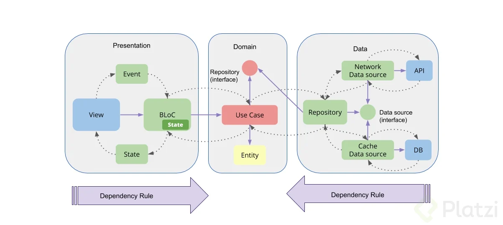

# Clean Architecture App with Flutter
Flutter Base to Clean architecture 

Clean Architecture - Flutter

Welcome in this boilerplate was built based on the best architecture practices, in which the following were taken into account:

    Modularization by layers and features
    Application of the Principles of Clean Architecture

Languages, libraries and tools used

    Dart
    Kotlin
    Swift
    Flutter Framework
    Bloc
    Get-it
    Dio

Architecture

The architecture of the project follows the principles of Clean Architecture. Here's how the sample project implements it:

architecture

data: Layer that contains the access point to the external data layers and is used to obtain data from multiple sources (cache and network).

domain: Layer that contains the UseCase instances used to retrieve data from the data layer and pass it to the presentation layer.

ui: Layer that contains functions for managing the user UI.

Dependency Injection with Get-it

Note:
This is a Core base model in which projects must be added in the future as UI Modules where their logic must be independent, only in cases of shared logic the core must be used.

 

<h3 align="center">Architecture Proposal</h3>

 

